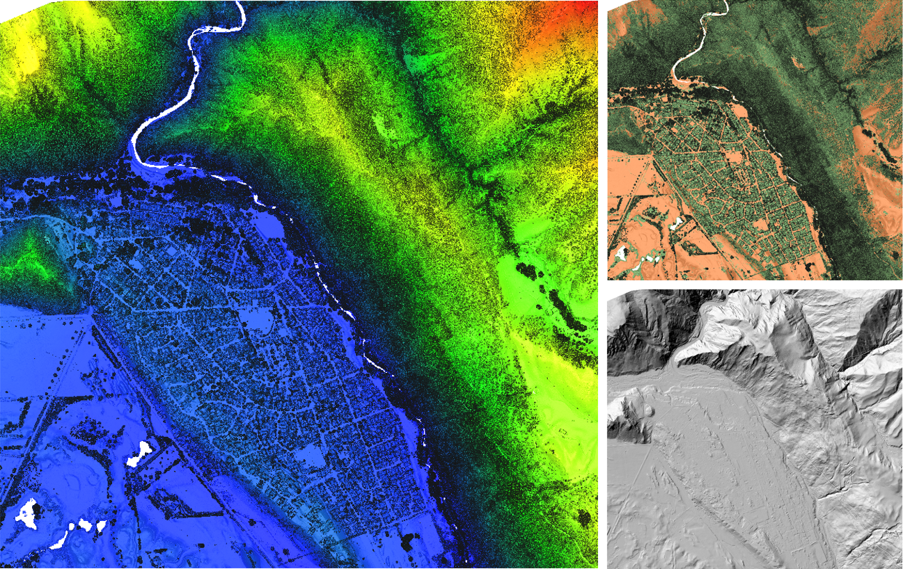
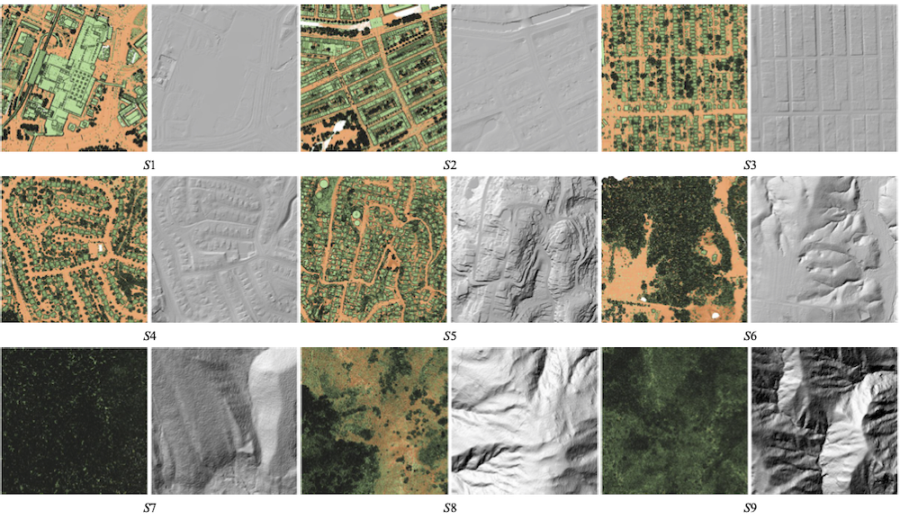
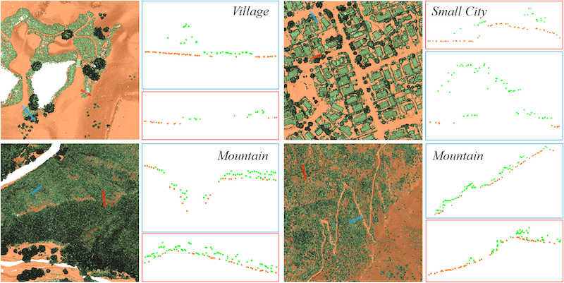
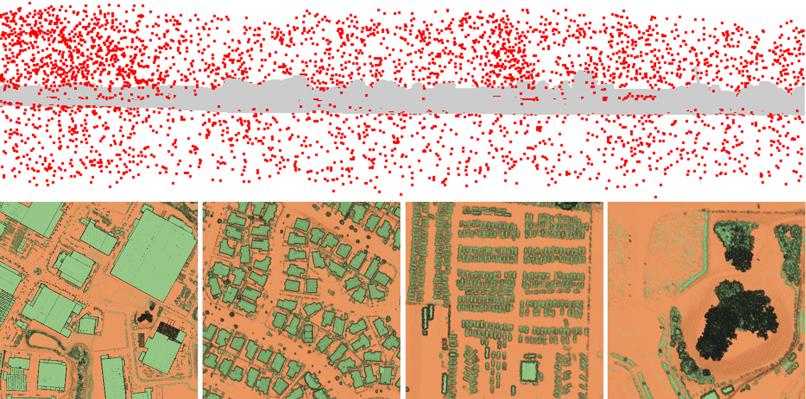

# OpenGF: An Ultra-Large-Scale Ground Filtering Dataset Built Upon Open ALS Point Clouds Around the World

**OpenGF: An Ultra-Large-Scale Ground Filtering Dataset Built Upon Open ALS Point Clouds Around the World**
Nannan Qin, Weikai Tan, Lingfei Ma, Dedong Zhang, Jonathan Li*

**[[Paper](https://arxiv.org/abs/2101.09641)] [[Homepage](https://uwaterloo.ca/geospatial-sensing/)]**

OpenGF is an Ultra-Large-Scale Ground Filtering dataset covering over 47 km2 built upon open ALS point clouds of 4 different countries around the world. It not only includes more than half a billion finely labeled ground and non-ground points, but also contains 9 different terrain scenes. The dataset will be released at Google Drive and 百度网盘 soon. **Currently, we are preparing the dataset, please stay tuned! Thanks a lot!**

An example of OpenGF

Typical samples belonging to 9 different terrain scenes

Challenging areas of Test I

Challenging areas of Test II

The data source of OpenGF comes from [AHN3](https://downloads.pdok.nl/ahn3-downloadpage/), [Opentopography](https://portal.opentopography.org/datasets), and [Ontario Point Cloud](https://geohub.lio.gov.on.ca/datasets/adf19376eecd4440a4579a73abe490f5).

## Citation

Please consider citing our paper:

    @article{qin2021opengf,
        title = {OpenGF: An Ultra-Large-Scale Ground Filtering Dataset Built Upon Open ALS Point Clouds Around the World},
        author = {Qin, Nannan and Tan, Weikai and Ma, Lingfei and Zhang, Dedong and Li, Jonathan},
        year = {2021},
        archivePrefix = {arXiv},
        eprint = {2101.09641},
    }

## Related projects

[Toronto-3D: A Large-scale Mobile LiDAR Dataset for Semantic Segmentation of Urban Roadways](https://github.com/WeikaiTan/Toronto-3D) 