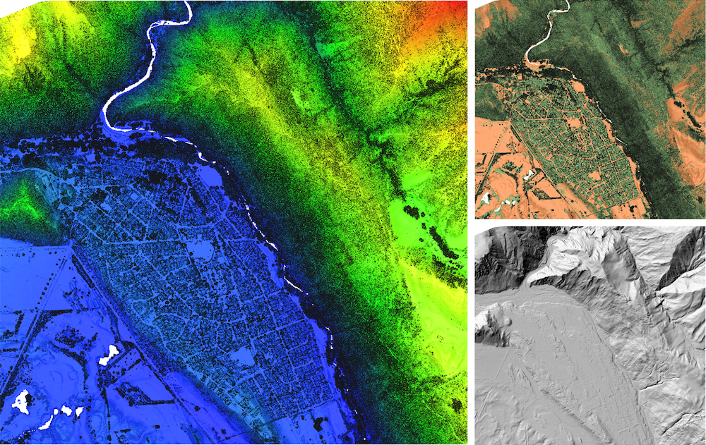
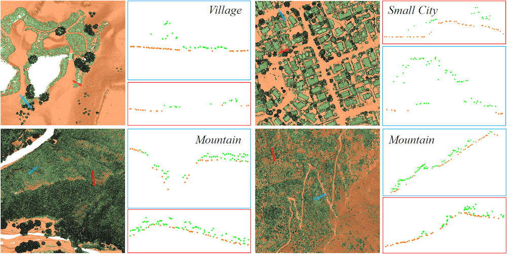
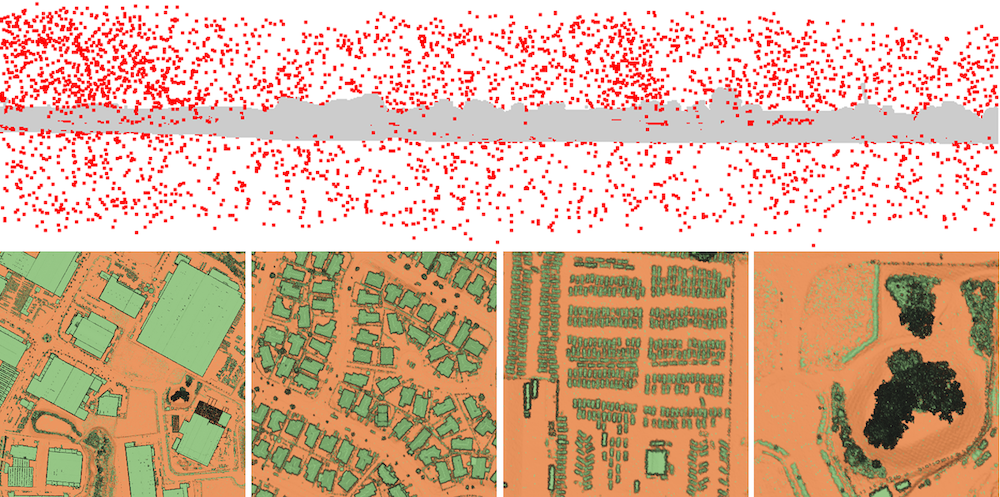

# OpenGF: An Ultra-Large-Scale Ground Filtering Dataset Built Upon Open ALS Point Clouds Around the World
OpenGF is an Ultra-Large-Scale Ground Filtering dataset covering over 47 km2 built upon open ALS point clouds of 4 different countries around the world. It not only includes more than half a billion finely labeled ground and non-ground points, but also contains 9 different terrain scenes. The dataset will be released at google drive and 百度网盘 soon.

An example of OpenGF

Typical samples belonging to 9 different terrain scenes

Challenging areas of Test I

Challenging areas of Test II

The data source of OpenGF comes from [AHN3](https://downloads.pdok.nl/ahn3-downloadpage/), [Opentopography](https://portal.opentopography.org/datasets), [Ontario Point Cloud](https://geohub.lio.gov.on.ca/datasets/adf19376eecd4440a4579a73abe490f5)
